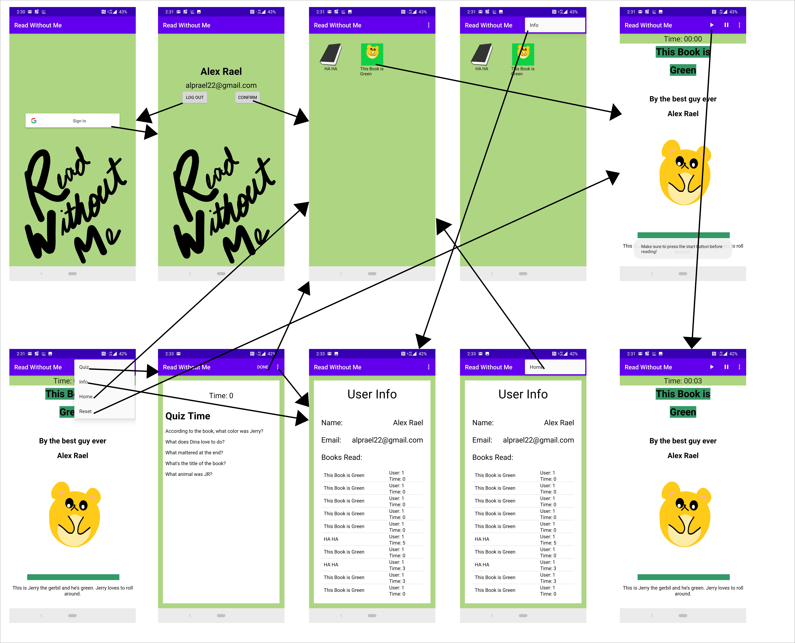

Read Without Me is a nice little Android reading app with the basic function of keeping track of
your children's reading behavior when you're not looking, and with a complex function of keeping track
of people's reading behavior and reading comprehension. Allow me to start off with the reasoning 
behind why I created this app before I explain what it does.

When I started android development I came in with the idea that I wanted to develop
apps that make people's lives just a little bit easier. As you'll read from my User Stories down 
below, you'll see what my true thought process was for the creation of this app. I truly believe 
that this app in it's current form, embodies that philosophy.

Read Without Me is meant for parents or people in a supervisory role to keep track of one's reading
habits and reading comprehension indirectly. There are a few books on the device ready for users to
engage in. Each book has a timer, which I believe is an important function to tracking a person 
reading level. Of course this timer can be easily manipulated, but still an important function. 
Along with keeping track of one's reading, it's equally important to know if that one retained the 
information they just read. Each book has a quiz . Either it has a quiz that directly asks 
questions to the contents of the book, or a default quiz is given with more general questions.
The user info panel gives per device information, since it wouldn't be as easy to track ones 
reading habits if they signed in under a different account. With all that in mind, you can 
understand that this app just makes it a bit easier to know if your child, or whoever you're 
supervising, is doing the reading you assign them.

By the way, I call them books, but books aren't the only type of media that can be supported in
this app. There could also be magazines, articles, textbooks, or even short stories. All of which 
are equally important.

## Technical Information
The minimum API level for this app is 21, however, the app has been tested to work on APIs 24 - 28.
The main emulator used for the above tests was the Nexus 5X. The main language used is English, and 
the current required orientation is portrait mode. In order to successfully sign into the app, a 
working internet connection is required.

As far as bugs go, I've already fixed a few of them, except one that occurs during the sign in
process. I've noticed, on occasion, Google sign in incorrectly displays the user name of the user
signing in. Once it incorrectly displays, pressing the confirm button will crash the app.
It has a problem inserting that data into the database as a new user. I say on occasion because it
might happen when you first run it on any api, but after that first initial run, it'll work fine.

Here are the added implementations and annotationProcessor needed:
```
implementation 'android.arch.persistence.room:runtime:1.1.1'
implementation 'com.google.android.gms:play-services-auth:16.0.1'
implementation 'com.android.support:support-media-compat:28.0.0'
implementation 'com.android.support:support-v4:28.0.0'
annotationProcessor "android.arch.persistence.room:compiler:1.1.1"
```
The first implementation and the annotationProcessor are for the use of the Room Persistence Library.
The last 3 implementations above are mostly for the use of Google Sign In. Google Sign In is the
only API this app consumes. You will need a [Google Sign In Credentials](https://developers.google.com/identity/sign-in/android/start-integrating)
file if you're going to successfully build and run the app. You can configure one at the link above.

Here are the added Java Compile Options needed:
```
javaCompileOptions {
            annotationProcessorOptions {
                arguments = ["room.schemaLocation": "$projectDir/schemas".toString()]
            }
            dataBinding {
                enabled = true
            }
        }
 ```
 Add this snippet directly under the TestInstrumentationRunner in the app module of the build.gradle file.
 This compile option gives a path location for room to store it's 1.json file.
 
## User Stories
* As a parent I want to be able to keep track of my children's reading while I cook dinner.
  * As a parent I want to able to be able to see what books my children have read, and how long it 
  took them.
  * As a parent, I want to be able to know if my children remembered the information they just read.
  * As a parent I want to actually know if My child read when I told them to.
* As a teacher I want to be able to keep track to whether or not my students read the assigned 
  reading.
  * As a teacher I want to keep track of my students reading level by understanding how long it took
  them to read an assigned reading.
  * As a teach I want to be able to see if my students are learning from the reading I assign.

## Wire Frames


## Physical Entity Relationship Diagram


## Licenses
This project is Licensed under the [Apache License 2.0](https://github.com/alprael/ReadWithoutMe/blob/master/LICENSE).

Google Sign In API for Android is implemented in this app and is licensed under the 
[Creative Commons Attribution 3.0 License](https://creativecommons.org/licenses/by/3.0/), and code 
samples licensed under the [Apache 2.0 License](http://www.apache.org/licenses/LICENSE-2.0). Here's
a [link](https://developers.google.com/android/reference/com/google/android/gms/auth/api/signin/package-summary) 
to the Google Sign In API resource page.

## Data Definition Language
Here's a link to my [RWM.sql](https://github.com/alprael/ReadWithoutMe/blob/master/RWM.sql) file.

## Java Documentation
Here's a link to my Java [docs](https://github.com/alprael/ReadWithoutMe/tree/master/docs) file.

## Build and Basic User Instructions
Here's a link to the [Build Instructions](https://github.com/alprael/ReadWithoutMe/blob/master/BuildInstructions.md) file.

Here's a link to the [Basic User Instructions](https://github.com/alprael/ReadWithoutMe/blob/master/BasicUserInstructions.md) file.

## Future Implementations
Here's a few aspects of the app I would love to have changed or added for future implementations. Here they
are in order of most important:
1. In the info section of the app, there's a list view which shows users which book they've read and what
times they got on those books. I would like the app to actually show the name of the user instead of 
the user's ID in that list view.
2. I would also like it if once you were at the home screen that pressing the back button kicked you
out of the app completely. 
3. Also, the timer in the user info and quiz screen be formatted correctly to reflect both minutes and seconds
instead of just seconds. 
4. I would like it if the app, design wise, fit more closely to Google's Material Design 
standards.
5. Add an API to populate the app with various books, articles, and magazines (possible Amazon Kindle
API or Google Books API.)
6. Would like to list view in the user info screen to update upwards instead of downwards so that
the user doesn't have to scroll down to the bottom of the list to see the most recent books
read, or reset that list view.
7. Allow quiz questions to have inputed answers that are saved and could be accessed later.
8. Add more books and quizzes.

## Thank You
Thank you for reading up to this point, and taking in all the information. I truly do believe this
app I've created is a useful tool to making someones life a little bit easier. I hope you find this app
to be equally as interesting and useful as I. Enjoy and have a wonderful day.
